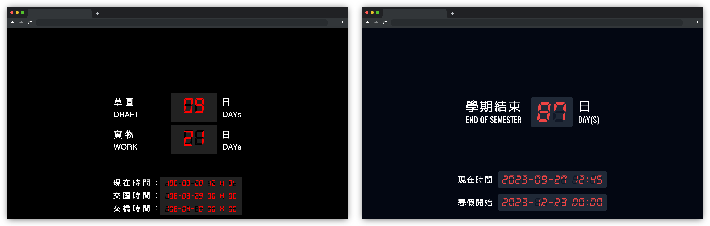

# Countdown: Remake

## About the Work

This original work was created on March 2019. It was used to calculate and display how many days were left until the deadlines of projects in my high school.

This reproduction does the exact same thing (the end of the semester instead of project deadlines), with some newer technologies.

## What's New

- React.js + dayjs
- Tailwind CSS
- New segment font [DSEG](https://www.keshikan.net/fonts.html)

## What's Removed

- jQuery
- Seperate stylesheet
